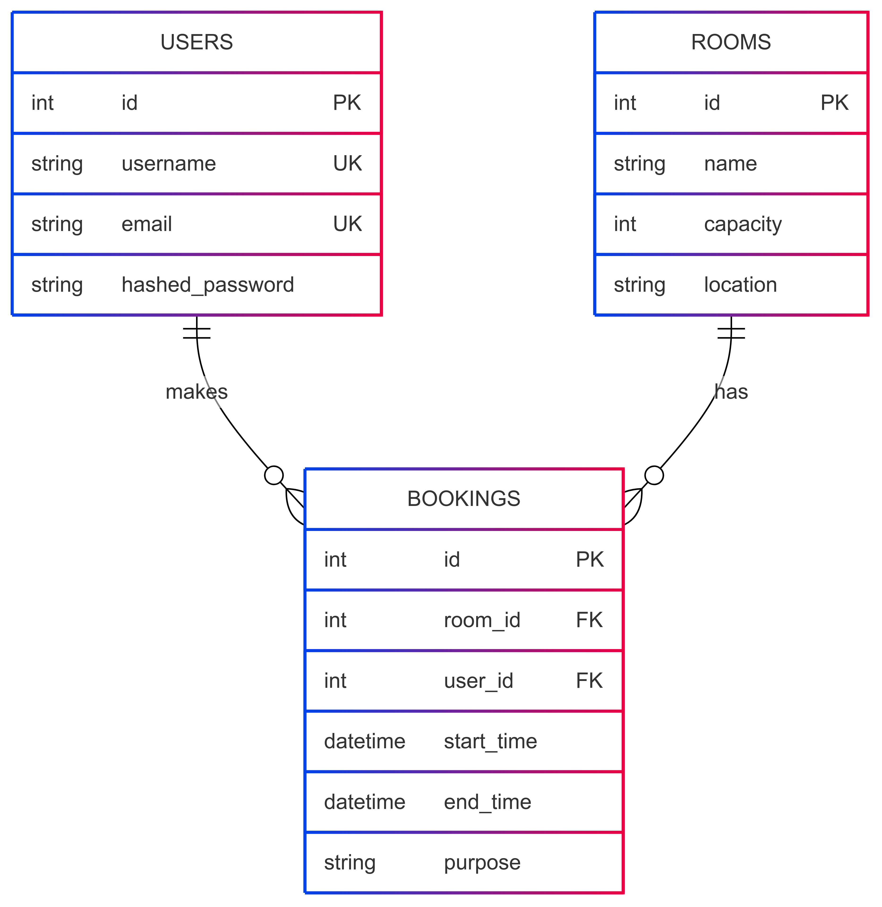

# Room-booking
A simple application that provide room booking functionality with REST API based on the FastAPI Python library.

# Database entities relationships diagram

<div style="width: 500px;">
  
</div>

PK: Primary key.

FK: Foreign key.

UK: Unique constraint.

# Requirements
python >= 3.10

# Environment setup
```
python -m venv venv

source venv/bin/activate

pip install -r requirements.txt
```

# Run app
```
fastapi run ./app/main.py
```
Then you can open in browser: `http://127.0.0.1:8000/docs`

# Formatter
Project has config `pyproject.toml` for black formatter, so you can simply run `black .` in CLI to format the project.

# Linter
This project used default linter config, so the current linter output you can found in ./pylint.txt.
To run linter the followint command can be used:

`pylint --ignore=venv,migrations,build . > pylint.txt`
